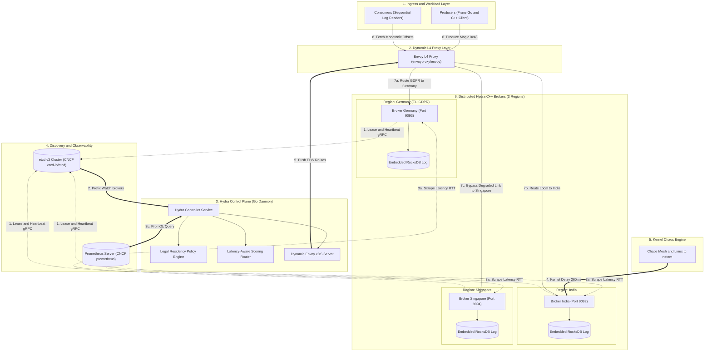

# Hydra Stream - Open Source System Connections

```mermaid
flowchart TB
    subgraph CLIENT_LAYER["1. Ingress and Workload Layer"]
        PROD["Producers (Franz-Go and C++ Client)"]
        CONS["Consumers (Sequential Log Readers)"]
    end

    subgraph PROXY_LAYER["2. Dynamic L4 Proxy Layer"]
        ENVOY["Envoy L4 Proxy (envoyproxy/envoy)"]
    end

    subgraph CONTROL_LAYER["3. Hydra Control Plane (Go Daemon)"]
        CTRL["Hydra Controller Service"]
        POLICY["Legal Residency Policy Engine"]
        ROUTER["Latency-Aware Scoring Router"]
        XDS_SERVER["Dynamic Envoy xDS Server"]
        
        CTRL --> POLICY
        CTRL --> ROUTER
        CTRL --> XDS_SERVER
    end

    subgraph OPEN_SOURCE_INFRA["4. Discovery and Observability"]
        ETCD[("etcd v3 Cluster (CNCF etcd-io/etcd)")]
        PROM[("Prometheus Server (CNCF prometheus)")]
    end

    subgraph CHAOS_LAYER["5. Kernel Chaos Engine"]
        CHAOS["Chaos Mesh and Linux tc netem"]
    end

    subgraph REGIONS["6. Distributed Hydra C++ Brokers (3 Regions)"]
        subgraph REGION_INDIA["Region: India"]
            BR_IN["Broker India (Port 9092)"]
            ROCKS_IN[("Embedded RocksDB Log")]
            BR_IN --> ROCKS_IN
        end

        subgraph REGION_GERMANY["Region: Germany (EU GDPR)"]
            BR_DE["Broker Germany (Port 9093)"]
            ROCKS_DE[("Embedded RocksDB Log")]
            BR_DE --> ROCKS_DE
        end

        subgraph REGION_SINGAPORE["Region: Singapore"]
            BR_SG["Broker Singapore (Port 9094)"]
            ROCKS_SG[("Embedded RocksDB Log")]
            BR_SG --> ROCKS_SG
        end
    end

    %% Registration
    BR_IN -.->|"1. Lease and Heartbeat gRPC"| ETCD
    BR_DE -.->|"1. Lease and Heartbeat gRPC"| ETCD
    BR_SG -.->|"1. Lease and Heartbeat gRPC"| ETCD

    %% Discovery Watch
    ETCD ==>|"2. Prefix Watch brokers"| CTRL

    %% Telemetry & Probes
    PROM -.->|"3a. Scrape Latency RTT"| BR_IN
    PROM -.->|"3a. Scrape Latency RTT"| BR_DE
    PROM -.->|"3a. Scrape Latency RTT"| BR_SG
    CTRL <==>|"3b. PromQL Query"| PROM

    %% Fault Injection
    CHAOS ==>|"4. Kernel Delay 260ms"| BR_IN

    %% xDS Config Push
    XDS_SERVER ==>|"5. Push EDS Routes"| ENVOY

    %% Ingress & Routing
    PROD -->|"6. Produce Magic 0x48"| ENVOY
    ENVOY -->|"7a. Route GDPR to Germany"| BR_DE
    ENVOY -->|"7b. Route Local to India"| BR_IN
    ENVOY -->|"7c. Bypass Degraded Link to Singapore"| BR_SG
    CONS -->|"8. Fetch Monotonic Offsets"| ENVOY
```
